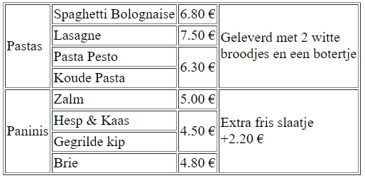
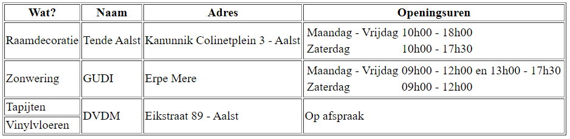
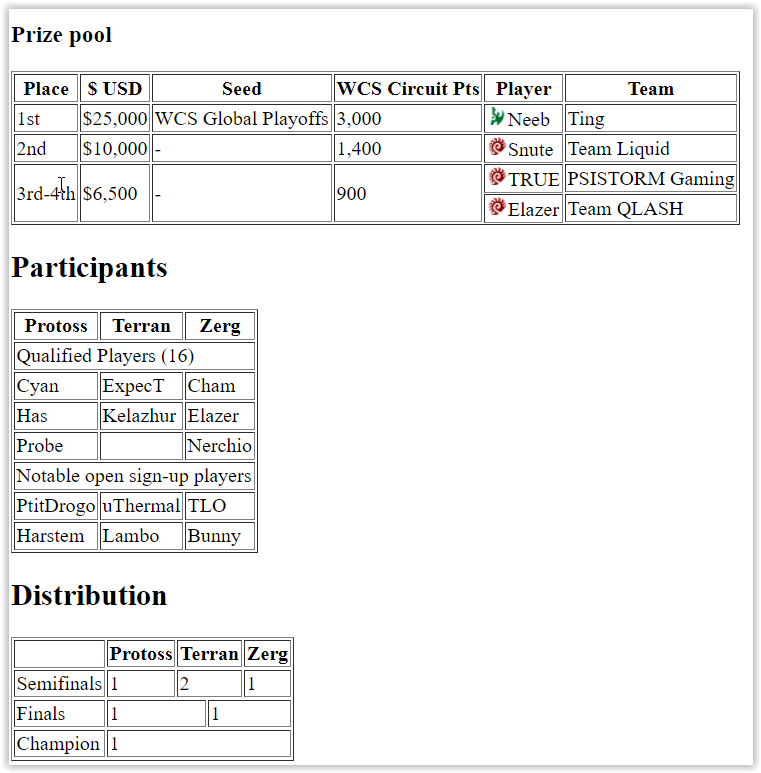
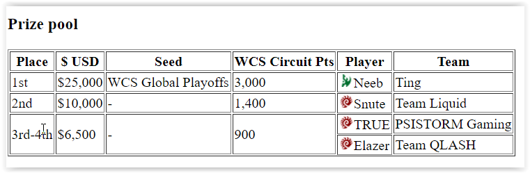
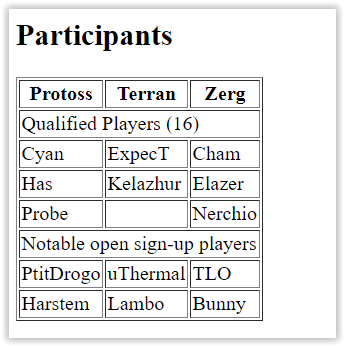
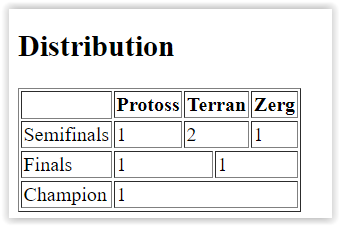

# Les 4 - Starter Oefeningen H5/H7 - Afbeeldingen & Tabellen
Download en unzip, of clone deze repository. Hiervoor klik je op de groene knop.

## OEFENING 1.
Maak in de hoofdmap een submap **Starteroefeningen** aan en maak in deze map een nieuw bestand genaamd **tabel1.html**.

Schrijf correcte html om een pagina te bekomen volgens onderstaande screenshot. Om de basis structuur van een html pagina snel aan te maken in de editor, gebruik je emmet (!tab).

**Hulpje:** je kan het _border_-attribuut met waarde _1_ toevoegen aan het **table**-element om de randen van de tabel zichtbaar te maken in de browser. Je krijgt dan exact hetzelfde resultaat als onderstaande screenshot. Verder in deze cursus zal je leren deze _opmaak_ in een apart _css-bestand_ op te nemen...

Denk eraan: **valideer** steeds je code op https://validator.w3.org/.

---

## OEFENING 2.
Maak analoog aan oefening 1 een pagina genaamd **tabel2.html**. Zorg voor volgende tabel op de pagina:

---

## OEFENING 3.
- Maak in de map **Starteroefeningen** een pagina genaamd **afbeelding1.html** en een submap genaamd **images**. 
- Zoek een afbeelding van een tsjechoslowaakse wolfhond, een saarloos wolfhond en een wolf. 
- Schaal elke afbeelding naar een breedte van 100px. _Je kan dit online doen of via een eenvoudig tekenprogramma zoals MS Paint_
- Bewaar deze afbeeldingen in de map images en bouw je pagina op volgens onderstaande screenshot.

 

---

## OEFENING 4 - Likwiepedia.
De Likwiepedia die in deze oefening gemaakt wordt is een eenvoudigere versie van de Liquipedia pagina voor het WCS Montreal. De focus ligt op het nabouwen van verschillende tabellen die op deze pagina te vinden zijn.
De afgewerkte site, met css-opmaak ziet er als volgt uit:

Hieronder zie je het resultaat van de tabellen zonder css.

In de map Likwiepedia vind je een map _images_ met de de afbeeldingen en het bestand _index.html_ waar je de tabellen moet aan toevoegen.

Maak eerst de **Prize pool** tabel, zoals hieronder. 

Tip: gebruik voor alle tabellen het table *attribuut* **border="1"** om de borders zichtbaar te maken, zoals hieronder weergegeven. Als de tabel klaar is verwijder je het attribuut opnieuw.      

Vervolgens de **Participant** table

Tot slot de **Distribution** table. _Merk op dat deze tabel per rij 5 kolommen (zonder colspan) heeft!_

